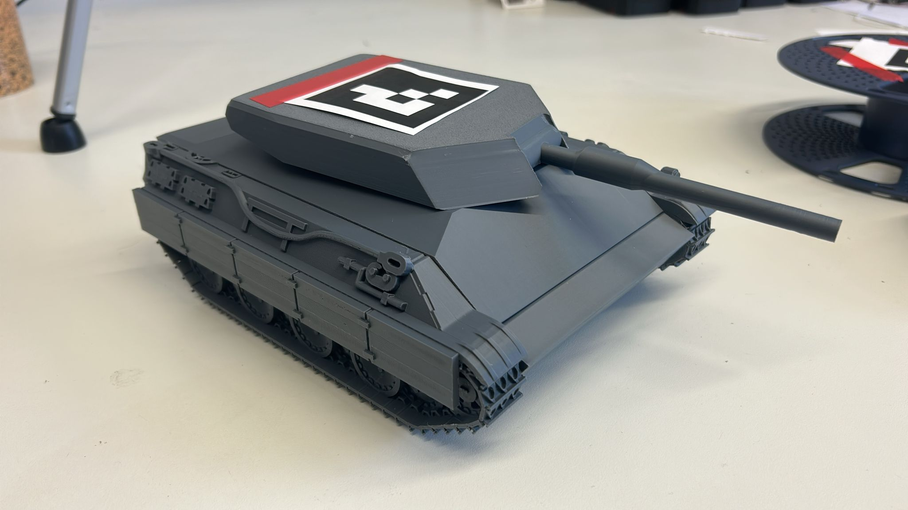

# ArUco Tanks

Ein kamerabasiertes Laser-Tag-Spielsystem mit ferngesteuerten ESP32-Fahrzeugen und markerbasierter Objekterkennung über ArUco-Marker.

Das Projekt wurde im Rahmen eines Studienprojekts an der **HTWK Leipzig** entwickelt.  
Die Treffererkennung erfolgt softwareseitig über eine externe Kamera, Computer Vision und eine zentrale Spiellogik auf dem Laptop.

  

---

## Inhaltsverzeichnis

- [Zielsetzung](#zielsetzung)
- [Systemübersicht](#systemübersicht)
- [Hardwareübersicht](#hardwareübersicht)
- [Software- & Repository-Struktur](#software--repository-struktur)
- [Getting Started](#getting-started)
- [Projektkontext](#projektkontext)
- [Nützliche Ressourcen](#nützliche-ressourcen)
- [Weiterentwicklung](#weiterentwicklung)
- [Lizenz](#lizenz)

---

## Zielsetzung

Ziel des Projekts ist die Entwicklung eines spielbaren Mehrkomponentensystems aus:

- zwei ferngesteuerten Fahrzeugen
- einer externen Kamerainstanz zur Objekterkennung
- einer zentralen Spielumgebung auf dem Laptop
- einer softwarebasierten Treffererkennung mit ArUco-Markern

Dabei werden mechanische Konstruktion, Mikrocontrollersteuerung, drahtlose Kommunikation, Kamerakalibrierung und Bildverarbeitung in einem Gesamtsystem kombiniert.

---

## Systemübersicht

Das Spielsystem basiert auf einer **markerbasierten visuellen Objekterkennung**.

- Eine externe Kamera erfasst das Spielfeld.
- Die Fahrzeuge tragen ArUco-Marker zur Positions- und Orientierungserkennung.
- Ein Laptop übernimmt die Bildverarbeitung und Spiellogik.
- Die Kommunikation mit den Fahrzeugen erfolgt drahtlos über ESP32-basierte Steuerung.
- Treffer werden nicht durch physische Sensoren, sondern über die geometrische Auswertung von Schusslinie und Hitbox in der Spielumgebung erkannt.

---

## Hardwareübersicht

### Fahrzeuge

- ESP32 Dev Board  
- LM2596 Step-Down Converter
- 2× DC Getriebemotoren 
- 28BYJ-48 Schrittmotor  
- WS-25514 Motorcontroller  
- ULN2003 Treibermodul  
- 7.4 V Li-Ion Akku  
- Hauptschalter (DPDT)
- Reset-Button

### Externe Komponenten

- Kamera zur Erfassung des Spielfelds
- Laptop zur Bildverarbeitung und Spielsteuerung
- Gamepad zur Fahrzeugsteuerung

### Markerbasiertes Tracking

- ArUco-Marker zur Identifikation der Fahrzeuge
- Kamerakalibrierung zur präziseren Positionsbestimmung
- Berechnung von Position, Orientierung und Schussrichtung im Kamerabild

### Benötigte Verbindungselemente

Für den Aufbau werden zusätzlich folgende Schrauben, Muttern und Gewindeeinsätze benötigt:

- **M2:** 5× M2×6 mm, 2× M2×13 mm, 6× Muttern, 1× Heatset-Insert
- **M2.5:** 10× M2,5×10 mm, 10× Muttern
- **M3:** 18× M3×6 mm, 2× M3×8 mm, 1× M3×10 mm, 10× Muttern, 7× Heatset-Inserts
- **M4:** 2× M4×8 mm, 2× Heatset-Inserts
  
---

## Software & Repository-Struktur

Dieses Repository enthält die zentralen Software- und CAD-Dateien des Projekts.

### CAD

`Baugruppe ArUcoTank`

- Konstruktionsdaten der Fahrzeugkomponenten
- Gehäuse-, Turm- und Halterungsstrukturen
- Grundlage für mechanischen Aufbau und Anpassungen

### Arduino-Code

`Arduino_Steuerungscode.ino`

- Fahransteuerung der Fahrzeuge
- Verarbeitung der Steuerbefehle
- Kommunikation mit der Spielumgebung
- Ansteuerung der Fahrzeugfunktionen über den ESP32

### Jupyter-Notebooks

`01_marker_and_calibration.ipynb`

- Erstellung und Test von ArUco-Markern
- Kamerakalibrierung
- Vorbereitung der markerbasierten Positionsbestimmung

`02_esp32_connection.ipynb`

- Verbindungsaufbau zwischen Laptop und Fahrzeugen
- Kommunikationslogik
- Test der Netzwerkverbindung

`03_detection_and_game_logic.ipynb`

- Objekterkennung mit Kamera
- Bestimmung von Fahrzeugposition und Orientierung
- Trefferlogik, Schussauswertung und Spielmechanik

---

## Getting Started

Das zugehörige Git-Repository enthält neben dem Quellcode auch die mechanische Konstruktion, eine Montageanleitung sowie die Notebooks zur Spielumgebung und Kamerakalibrierung.

Die Montageanleitung befindet sich im Ordner docs.

### Voraussetzungen

Benötigt werden unter anderem:

- Python 3.x
- Jupyter Notebook
- OpenCV mit ArUco-Unterstützung
- NumPy
- ein ESP32-basiertes Fahrzeug
- eine geeignete Kamera
- optional ein Gamepad zur Steuerung

### Empfohlene Reihenfolge

1. ArUco-Marker erzeugen und Kamera kalibrieren  
2. Verbindung zum ESP32 testen  
3. Detektion und Spielumgebung starten  
4. Fahrzeuge im Kamerabild erfassen und Spiel testen  

---

## Projektkontext

Das Projekt entstand im Rahmen des Moduls  
**„Ausgewählte Themen der Automatisierungstechnik“**  
an der **HTWK Leipzig**.

Im Fokus standen insbesondere die Verknüpfung von:

- integrierte Steuerung
- drahtloser Kommunikation
- Computer Vision
- spielbezogener Systemintegration
- iterativer praktischer Entwicklung

---

## Nützliche Ressourcen

### OpenCV / ArUco

- OpenCV Dokumentation
- ArUco Marker Detection
- Kamerakalibrierung mit OpenCV

### ESP32

- ESP32 Dokumentation
- Arduino IDE / ESP32 Board Support

### Python / Notebook-Umgebung

- Jupyter Dokumentation
- NumPy Dokumentation

---

## Weiterentwicklung

Mögliche Erweiterungen des Systems:

- mehrere Kameras zur besseren Spielfeldabdeckung
- autonome Fahrfunktionen
- Erweiterung auf mehr als zwei Fahrzeuge
- verbesserte Benutzeroberfläche für Spielstatus und Punkteanzeige
- optimierte Netzwerkkommunikation und Synchronisation

---

## Projektteam

- Robert B.
- Hieu D.
- Jonas W.

## Lizenz

Dieses Projekt steht unter der **MIT License**.
